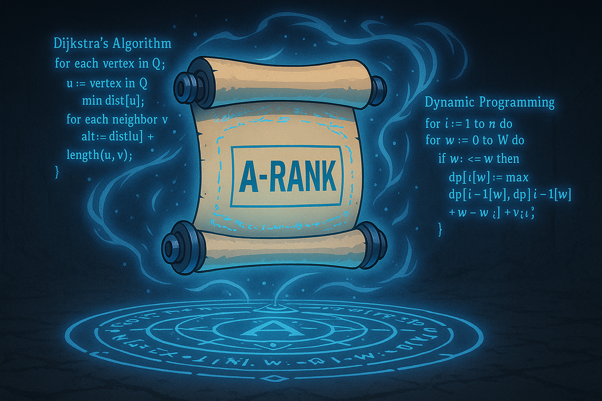

# 🔴 A-Rank — Advanced Spellcasting

**Status:** Code Sorcerer [🔒 Locked]
**Mission:** Unlock advanced paths and arcane problem-solving.

## 🧠 Concepts
- Dynamic Programming (1D/2D)
- Greedy Algorithms
- Backtracking
- Bit Manipulation

## 🎯 Goals
- Solve 30+ problems
- Identify optimal substructure
- Choose between greedy vs DP

## 🧪 Dungeon Quests
- 0/1 Knapsack
- Longest common subsequence
- Subsets with backtracking
- N-Queens

> “The system now sees you as a real threat.”
