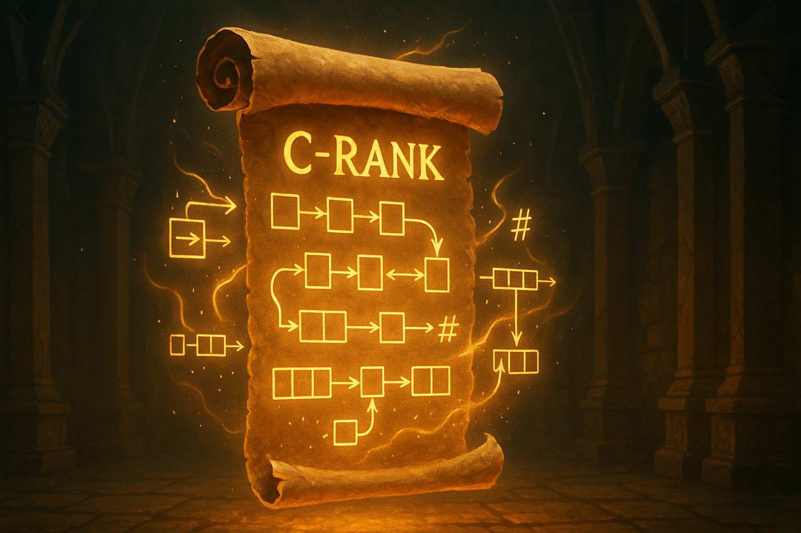

# 🟣 C-Rank — Tactical Awakening

**Status:** Capable [🔒 Locked]
**Mission:** Master connections and dynamic logic.

## 🧠 Concepts
- Linked Lists (Singly/Doubly)
- Hashmaps & Frequency Counting
- Two Pointer Techniques

## 🎯 Goals
- Solve 25 problems on lists and hashing
- Understand space/time tradeoffs
- Implement hashmap-based logic

## 🧪 Dungeon Quests
- Remove N-th node
- Detect loop in linked list
- Two-sum problem
- Group anagrams

> “Now you begin seeing how to *cut* through problems instead of just solving them.”
