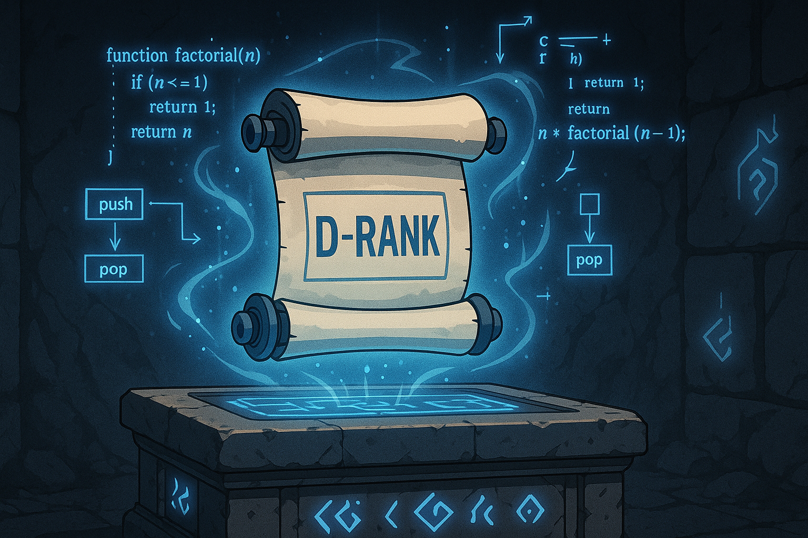

# 🔵 D-Rank — First Power Surge

**Status:** Getting Stronger [🔒 Locked]
**Mission:** Understand the hidden structures of code.

## 🧠 Concepts
- Recursion (Intermediate)
- Stacks & Queues
- Prefix Sum
- Sliding Window

## 🎯 Goals
- Solve 20+ problems using stack/queue logic
- Recognize recursive problems in disguise

## 🧪 Dungeon Quests
- Balanced parentheses
- Next greater element
- Sliding window max
- Prefix sum on arrays

> “You now wield structures that can crush simpler monsters.”
