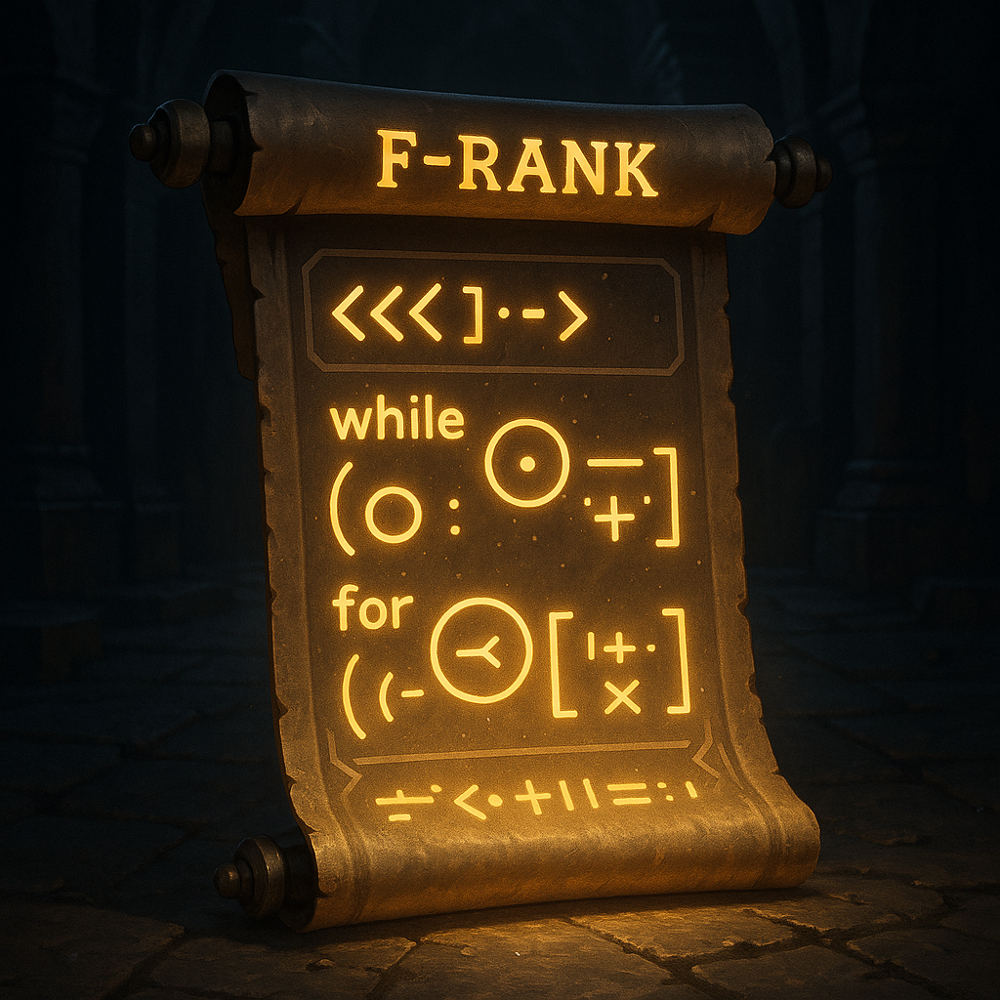

# 🟤 F-Rank — The Awakening

**Status:** Just Awakened  
**Mission:** Learn the basics. Prepare your mind and sword.

## 🧠 Concepts
- Arrays
- Basic Input/Output
- Loops (for, while)
- Conditionals (if-else)
- Time Complexity (Intro)

## 🎯 Goals
- Solve 15 basic problems
- Understand how loops & arrays interact
- Write your own functions

## 🧪 Dungeon Quests
- Reverse an array
- Find min/max
- Print pattern pyramids
- Sum of digits

> “Even Jin-Woo started from F-Rank… but so did everyone else.”
