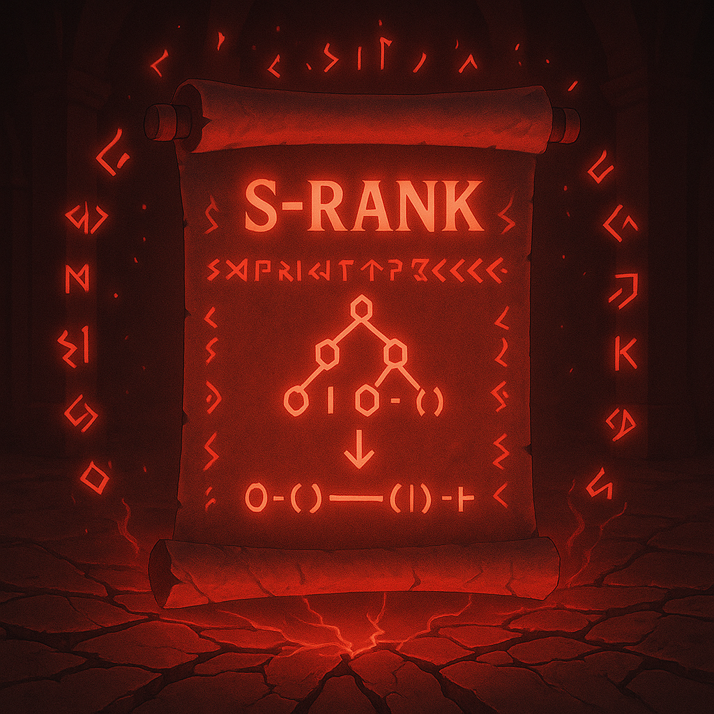

# ⚫ S-Rank — Monarch of Code

**Status:** Supreme Being [🔒 Locked] 
**Mission:** Dominate complexity and challenge reality.

## 🧠 Concepts
- Advanced DP (Bitmask, DP on Trees)
- Segment Trees / Fenwick Trees
- Trie
- Game Theory & Optimization

## 🎯 Goals
- Implement custom data structures
- Solve real-world level CP problems
- Build your own mini-system

## 🧪 Dungeon Quests
- Bitmask DP (Travelling Salesman)
- Range Sum Query (Segment Tree)
- Trie prefix matching
- Sprague-Grundy (Game Theory)

> “You don’t just solve problems now… You create worlds.”
